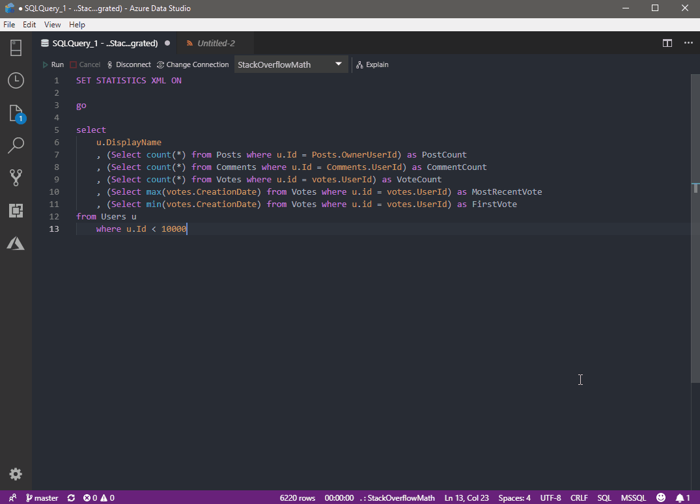

# QueryPlan.Show Azure Data Studio Extension

This extension integrations https://queryplan.show into Azure Data Studio

## Installation

The [current release](https://github.com/phil-scott-78/azure-data-studio-queryplan-show/releases) is available to download as a .vsix file and can be installed by opening the command palette (`ctrl/command+shift+p`) and selecting `Extensions: Install from VSIX...`

## Features

From an open XML file with a valid SQL queryplan run the `QueryPlan.Show` command from the command pallete (`ctrl+shift+p`)

## Data Privacy

All processing is done on your local machine. No data or files are sent to any remote servers. 